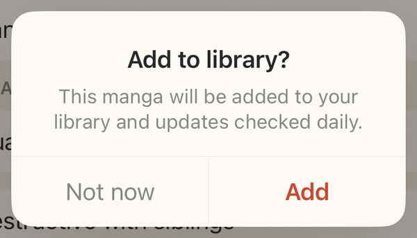
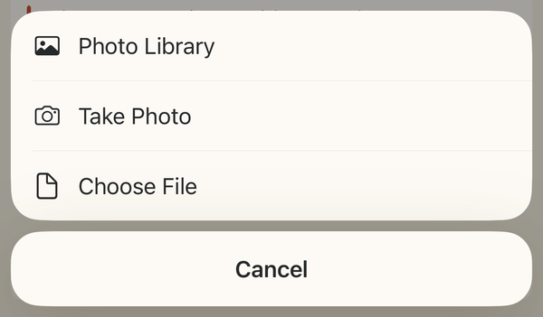
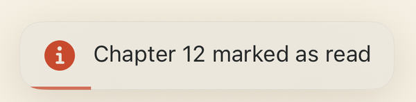
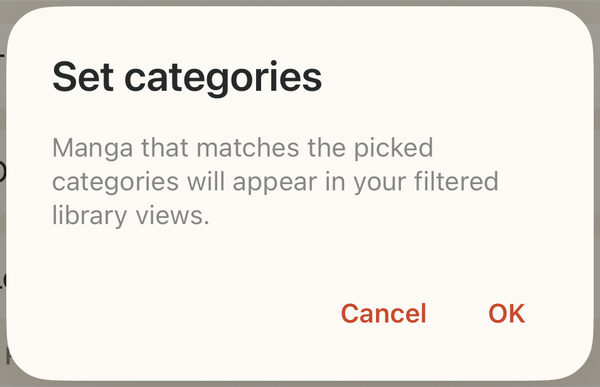
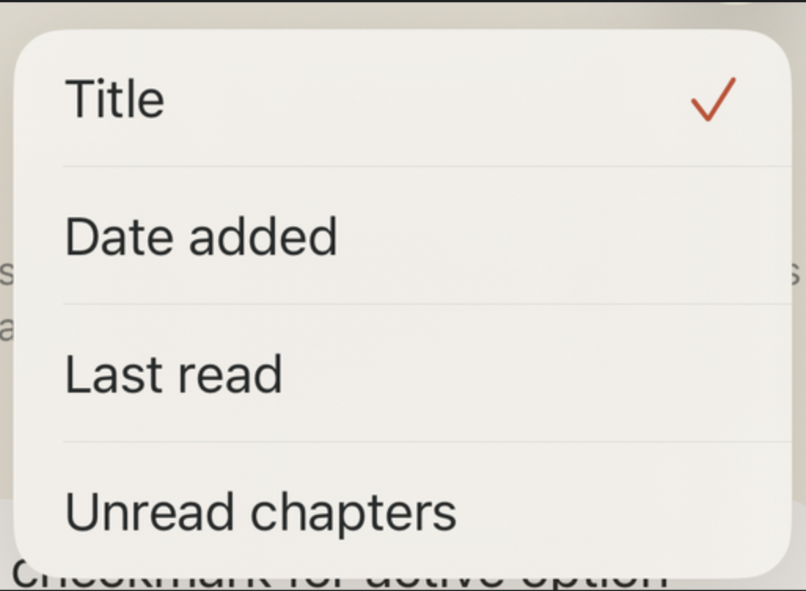
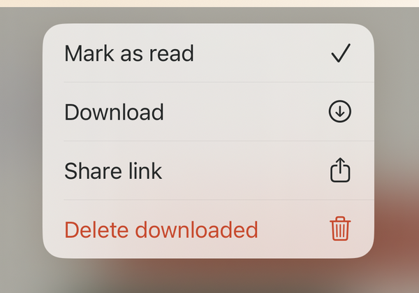
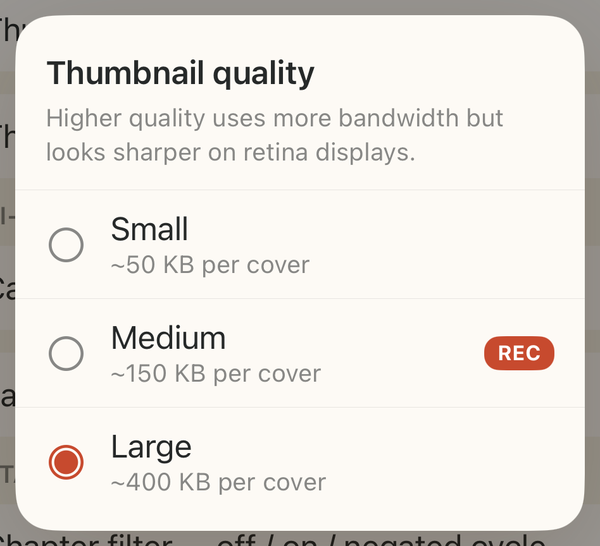
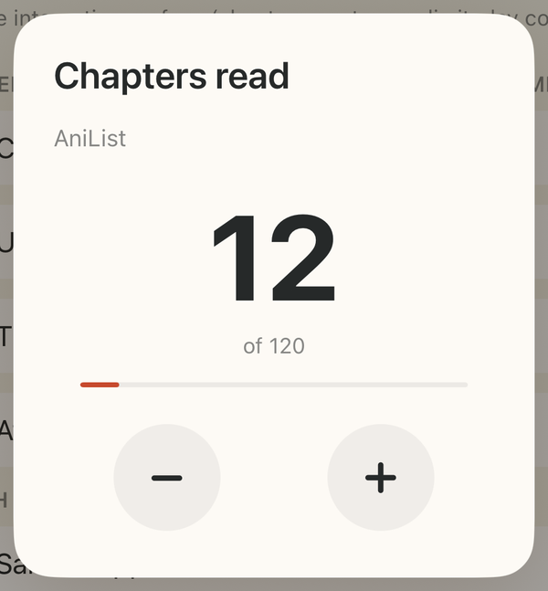

# Sumi

A manga-inspired UIKit design system for iOS.

Paper-cream surfaces, sumi-ink text, a vermillion hanko-stamp accent — a small
set of token-driven components that replace the stock `UIAlertController` family
with a coherent, production-grade look. Every component ships as its own SPM
product, so you import only the chrome you actually use.

> Sumi began as the in-house design system of a production iOS app, then was
> extracted and open-sourced. For the full story — the why, the aesthetic, and
> the architecture — see **[docs/ABOUT.md](docs/ABOUT.md)**.

## Gallery

Every component, exercised in the bundled **Demo** catalog:

<table>
  <tr>
    <td align="center" valign="top"><br><sub><b>SumiAlert</b></sub></td>
    <td align="center" valign="top"><br><sub><b>SumiSheet</b></sub></td>
    <td align="center" valign="top"><br><sub><b>SumiToast</b></sub></td>
  </tr>
  <tr>
    <td align="center" valign="top"><br><sub><b>SumiDialog</b></sub></td>
    <td align="center" valign="top"><br><sub><b>SumiMenu</b></sub></td>
    <td align="center" valign="top"><br><sub><b>SumiContextMenu</b></sub></td>
  </tr>
  <tr>
    <td align="center" valign="top"><br><sub><b>SumiPicker</b></sub></td>
    <td align="center" valign="top"><br><sub><b>SumiStepper</b></sub></td>
    <td></td>
  </tr>
</table>

> **These are just one example of each.** Every component ships many variants —
> one / two / three actions, `destructive` · `cancel` · `primary` styles, icon
> columns, toggles, sliders, badges, single / multi / tri-state selection, search,
> submenus, and edge-case layouts — all configurable through the component's API.
> Need something bespoke? A `customContent` slot lets you drop an arbitrary
> `UIView` into an alert or dialog. The **Demo** app exercises every variation.

## Design language

Two-layer token model:

| Layer | What | Where |
|---|---|---|
| **Brand** | Raw palette named after manga materials (`kamiCanvas`, `sumiInk`, `shuVermillion`) | `Sumi.Brand.*` |
| **Semantic** | Role-named tokens consumers use (`surface`, `textPrimary`, `accent`, `danger`) | `Sumi.Color.*`, `Sumi.Shadow.*`, `Sumi.Font.*` |

Light-only by design — the cream surface *is* the identity.

## Components

| Module | What it provides |
|---|---|
| `Sumi` | Design tokens (colour, shadow, typography, spacing, radius, motion). Every component depends on this. |
| `SumiAlert` | Modal decision dialog with an async/await API. Replaces `UIAlertController(.alert)`. |
| `SumiSheet` | Bottom action sheet with icon column, destructive style, swipe-to-dismiss. Replaces `UIAlertController(.actionSheet)`. |
| `SumiToast` | Non-blocking transient overlay with queue, swipe, and optional action. |
| `SumiDialog` | Material-style dialog with text fields, inline async validation, and custom content slots. |
| `SumiMenu` | Tap-anchored popover with sections, search, toggles, and sliders. |
| `SumiContextMenu` | Long-press preview + actions on a blurred backdrop. |
| `SumiPicker` | Single / multi / tri-state choice dialog with animated indicators. |
| `SumiStepper` | Hero-sized integer stepper card for dialog content slots. |
| `SumiTable` | Compact key → value table for embedding inside an alert / dialog. |
| `SumiMenuKit` | Shared infrastructure for `SumiMenu` + `SumiContextMenu`. |

## Requirements

- iOS 13+
- Swift 5.9 / Xcode 15+

## Installation

Swift Package Manager — add the package and depend on the products you need:

```swift
dependencies: [
    .package(url: "https://github.com/nobottomline/Sumi.git", from: "0.1.0")
],
targets: [
    .target(
        name: "MyFeature",
        dependencies: [
            .product(name: "Sumi", package: "Sumi"),
            .product(name: "SumiAlert", package: "Sumi"),
        ]
    )
]
```

## Usage

```swift
import SumiAlert

let pick = await Alert.present(
    title: "Delete item?",
    message: "This can't be undone.",
    actions: [
        .init(title: "Cancel", style: .cancel),
        .init(title: "Delete", style: .destructive)
    ]
)
if pick?.style == .destructive { delete() }
```

Importing `SumiAlert` pulls in only the alert and the `Sumi` token layer —
nothing else.

## Demo

The `Demo/` app is an interactive catalog: open a component and exercise every
variant (single / multi / tri-state, destructive / cancel, icon / icon-less
rows, edge cases) without wiring it into a host app.

```bash
open Demo/Demo.xcodeproj
```

## Why "Sumi"

墨 — *sumi*, the ink used in manga line-art. Every surface is paper, every
stroke is ink, every accent is a hanko-stamp seal. The design system is the
language for putting that ink down on screen.

## License

[MIT](LICENSE)
